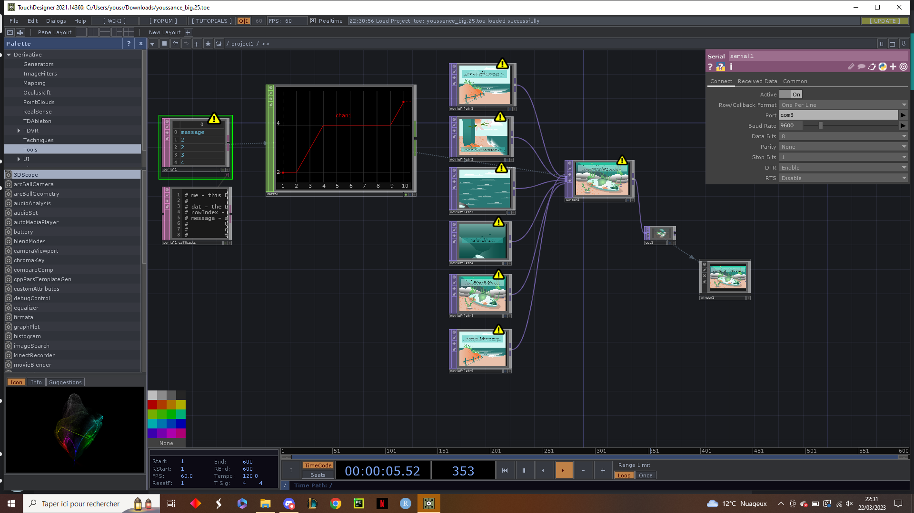

# Le peuple des profondeurs

## Projet Encre 🐋⚰️

### Participants :
* <strong>Ingénieurs ([Polytech Nantes](https://polytech.univ-nantes.fr/)) :</strong>
  * [Corentin Banier](https://github.com/cbanier/)
  * [Omar Jeridi](https://github.com/JeridiOmar/)
  * [Yousri Lajnef](https://github.com/ylajnef)
  
* <strong>Designers ([L'École de design Nantes Atlantique](https://lecolededesign.com/fr)) :</strong>
  * Aurélien Bourdet
  * Enora Jaffre
  * Kateline Jaslier
  * Jianing Leguen
  * Pauline Pedel
  * Charles Podo

### Thématique :
Encre est un projet prospectif et innovant répondant aux enjeux actuels de la biodiversité marine et des saturations de nos cimetières. A l’instar des carcasses de baleines, l’objectif est de redynamiser les abysses à l’aide de nos défunts. Grâce à cette initiative de cimetière marin, la mort n’est plus une fin, mais le début d’une nouvelle vie pour nos proches. Ce principe existe déjà aux Etats-Unis avec les forêts cimetières où les cendres des décédés servent d’engrais.

### Dispositif :
<strong> 1) Maquette :</strong>


<strong> 2) Technologies utilisées :</strong>
* Carte Arduino
* TouchDesigner
* Librairie FastLED

<strong> 3) Maquette électronique :</strong>
Le fichier ```/doc/ArduinoModel.pdf``` représente le circuit électronique détaillé du projet.

<ins>Voici une version simplifiée de la maquette :</ins>

<em>Remarque : La maquette ci-dessus ne mentionne pas le condensateur qui est utilisé pour le ruban de LED.</em>


### Détails technique :
<strong> 1) Code source :</strong>
Le code source figure dans le fichier ```/src/encre.c```.
Le fichier est commenté afin d'en comprendre son fonctionnement.

<strong> 2) Librairie FastLED :</strong>
Le fichier ```/src/colorpalettes.cpp``` doit remplacé le fichier initial ```colorpalettes.cpp``` présent dans le code source de la librairie FastLED.

<strong> 3) TouchDesigner :</strong>
Le fichier ```/src/encre_screen_switcher.toe``` est l'archive du projet TouchDesigner.



<em>Remarque : TouchDesigner lit la sortie standard de la carte Arduino, d'où les ```Serial.println()``` dans le code source.</em>